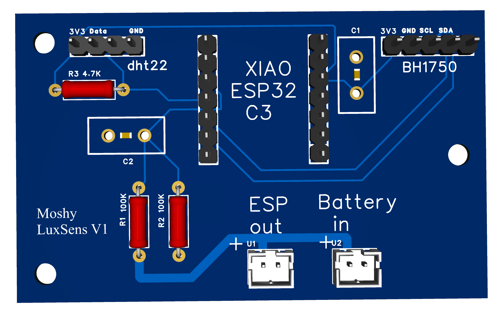

# 🌞 LuxTempMeter – ESP32 Light & Temperature Sensor

LuxTempMeter is a small ESP32-based sensor board for measuring:

- 📊 Ambient light (lux)
- 🌡 Temperature (DHT22)
- 📡 Designed for Home Assistant / IoT setups
- ⚙ Built with PlatformIO

---

## 📸 PCB Preview

---

## 🔧 Features

- ESP32 (low power capable)
- Light sensor (BH1750)
- DHT22 temperature sensor
- Designed for low power 
- Compact custom PCB

---

## 📁 Project Structure 

